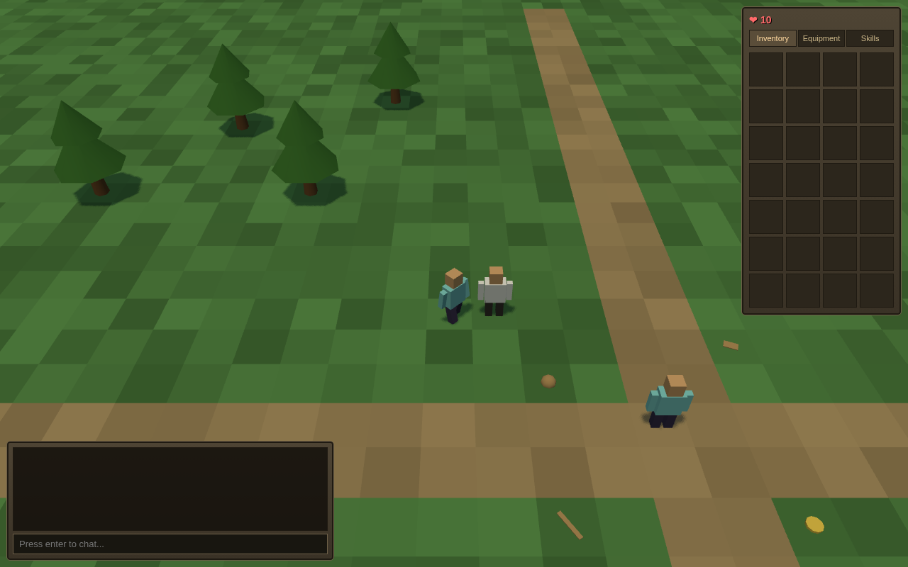

# OSRS Clone

A small browser-based Old School RuneScape clone: a low-poly 3D world rendered with Three.js,
an authoritative Node game server simulating the world on the classic 600ms game tick, and
OSRS-style mouse-driven interaction (left-click for the primary action, right-click for the
full option menu).



## Features

- **One 64×64-tile chunk** — grass plains, dirt paths, a pond, trees, and a goblin camp
- **Click-to-move** — BFS pathfinding on the tile grid (wiki neighbour order, no corner
  cutting), walking 1 tile per tick
- **Right-click context menus** — `Take`, `Attack`, `Talk-to`, `Chop down`, `Walk here`,
  `Examine`, `Cancel`; left-click performs the top option
- **Multiplayer** — every browser tab is a separate character in the same world; pick a
  display name on load (no accounts)
- **Chat** — chatbox plus text floating above the speaker's head
- **Items & inventory** — 28 slots, stackables (coins) share a slot, ground item stacks,
  item spawns that respawn, Take/Drop/Use/Examine
- **Equipment** — helmet and weapon slots (Wield/Wear), visible on the 3D character model
- **NPCs** — the Lumbridge Guide (Talk-to dialogue) and wandering goblins
- **Combat** — simplified OSRS melee formulas, 4-tick attacks, hitsplats, HP bars, NPC
  drops and respawns, player death and respawn
- **Skills & XP** — Attack, Strength, Defence, Hitpoints, Woodcutting with the real OSRS
  XP table; chop trees for logs (requires an axe)

## Running it

```sh
npm install
npm run dev
```

Then open http://localhost:5173 in two or more tabs, pick different names, and say hi.
The WebSocket game server listens on port 8080; Vite serves the client on 5173.

## Controls

| Input              | Action                                           |
| ------------------ | ------------------------------------------------ |
| Left click         | Walk / primary action of what's under the cursor |
| Right click        | Open the option menu                             |
| Middle-mouse drag  | Rotate the camera                                |
| Arrow keys         | Rotate / tilt the camera                         |
| Scroll wheel       | Zoom                                             |
| Enter (in chatbox) | Send chat                                        |

## Architecture

npm workspaces monorepo, TypeScript strict everywhere:

- `packages/shared` — Zod protocol schemas, item/NPC/world definitions, XP table and
  combat formulas (pure functions, fully tested)
- `packages/server` — authoritative simulation: a pure `runTick(world, intents, rng)`
  function driven by a 600ms interval, plus a thin `ws` WebSocket shell. Clients only send
  intents; the server broadcasts a personalised snapshot every tick
- `packages/client` — Vite + React for the 2D UI (inventory, equipment, skills, chat,
  context menu, dialogue) and a thin untested Three.js adapter that maps client state to
  meshes. All game logic in the client lives in a tested pure reducer and menu builder

## Tests

```sh
npm test          # shared + server (node) and client UI (Vitest browser mode, chromium)
npm run typecheck
```

End-to-end verification scripts (need `npm run dev` running in another terminal):

```sh
node scripts/verify.mjs            # two tabs: login, walk, context menu, chat overhead
node scripts/verify-features.mjs   # take/equip items, dialogue, woodcutting, combat
```
